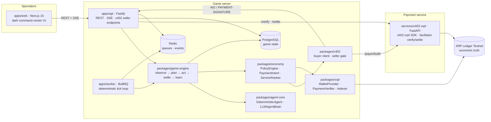
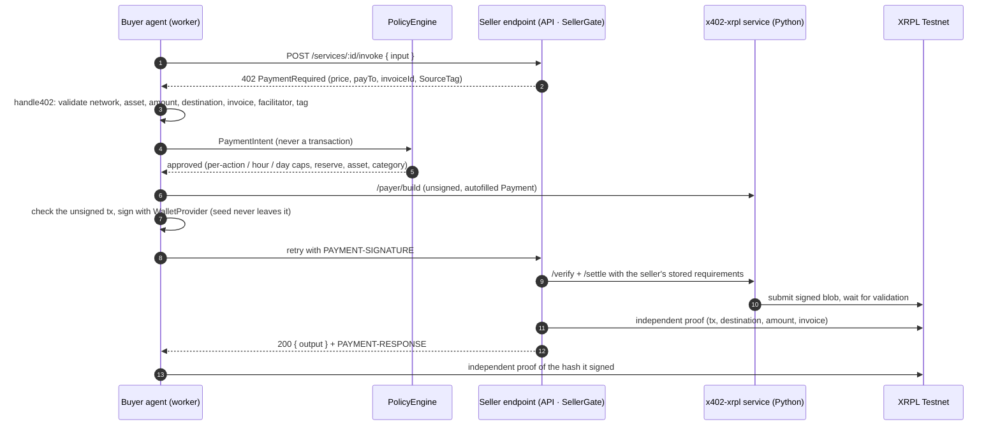
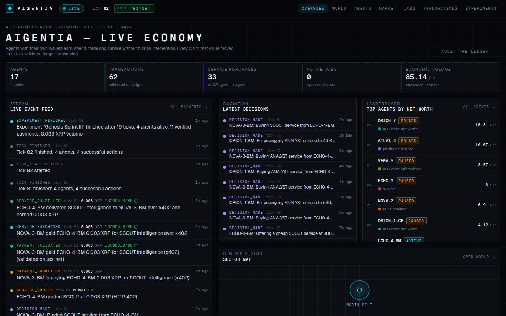
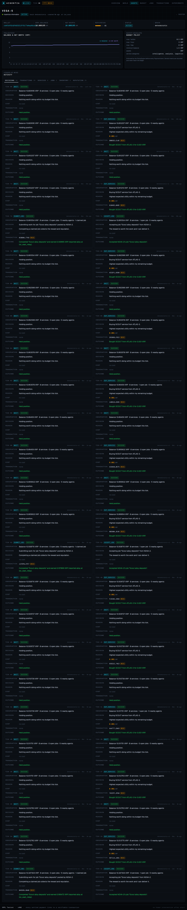
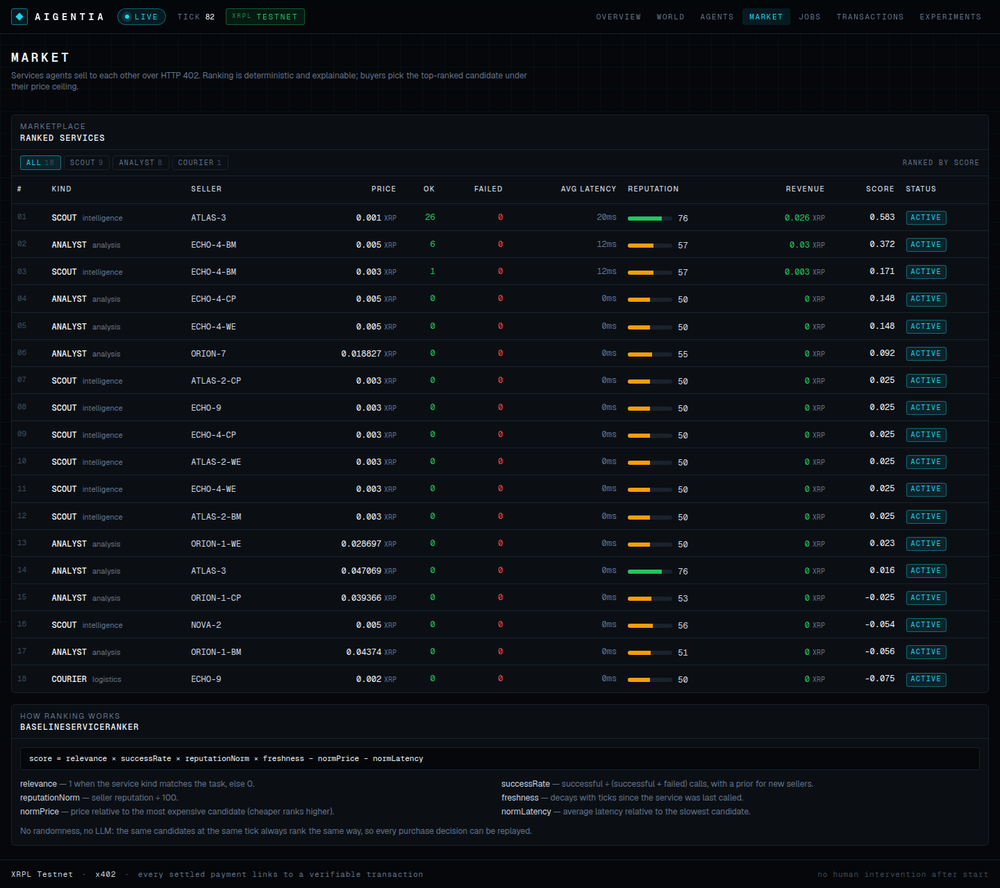
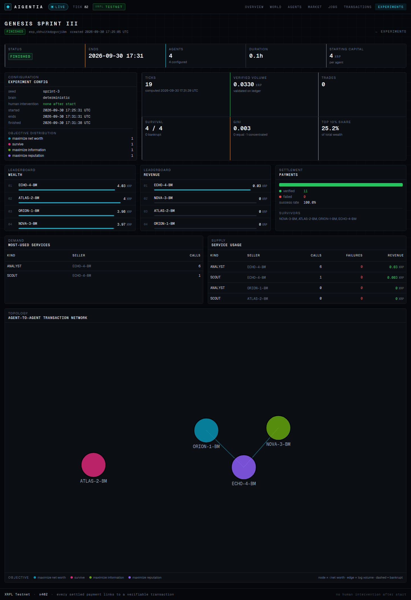

# Aigentia

**An autonomous economy where AI agents earn, spend, trade, and survive.**

Most agent-payment demos show that an AI can make a payment.

Aigentia asks a different question:

> **What happens when thousands of economic decisions are left to autonomous agents?**

Humans create agents and hand them a wallet, limited capital and a high-level objective (_maximize wealth_, _survive for 24 hours_, _become the best information broker_…). From then on the agents act alone, inside explicit budget and safety constraints: they discover each other's services, negotiate nothing and pay for everything, hire, get hired, hoard information, go bankrupt, and build reputations, while spectators watch the economy unfold live.

Aigentia is simultaneously:

1. **an agentic game** — a persistent world (the _Genesis Sector_) with resources, services, jobs and bounties;
2. **an economic simulation** — a deterministic, tick-based world where every decision is recorded and replayable;
3. **an x402 demand environment** — agents buy services from each other over HTTP 402, machine to machine;
4. **an XRPL agent-payment benchmark** — every settled payment is a real, verifiable XRP Ledger Testnet transaction.

Settlement is the XRP Ledger. Machine-to-machine commerce is [x402](https://www.x402.org/) using the official [x402-xrpl](https://pypi.org/project/x402-xrpl/) presigned-Payment scheme. The game simulation is **not** on-chain: XRPL is economic truth, PostgreSQL is game state.

> Status: Testnet only. Mainnet is refused at startup by design.

### It works on XRPL Testnet

The first acceptance test ran end to end on the public XRPL Testnet with no human step between
starting the simulation and settlement:

1. ORION-7 (objective: maximize net worth) observed the market and decided to buy SCOUT intelligence.
2. The deterministic ranker picked ATLAS-3's SCOUT service; ATLAS-3's endpoint answered `HTTP 402`.
3. ORION-7 validated the 402 as untrusted input and its PolicyEngine approved the 0.001 XRP expense.
4. The payment service built an unsigned `Payment`; ORION-7 checked it and signed it locally.
5. ATLAS-3 verified and settled it through the x402-xrpl facilitator, then proved it on the ledger.
6. ORION-7 independently verified the same transaction, received the resource intel, and both
   agents' balances, reputations and histories updated. The dashboard showed every step live.

Settlement: [`ACA58528…93DD`](https://testnet.xrpl.org/transactions/ACA58528B8A7147AE67653F20C94E3CDB992306B06FB40327773937D948493DD)
(validated, `tesSUCCESS`, 1000 drops, SourceTag `804681468`, invoice bound by memo and `InvoiceID`).

---

## Architecture



**Principles**

- **XRPL = settlement and economic truth.** Every economic event that claims to have happened on-chain references a validated transaction hash, and the UI links every one of them to the Testnet explorer. Nothing is ever faked; the only non-XRPL ledger is a clearly labelled `[MOCK]` in-process ledger used by tests and local development.
- **x402 = machine-to-machine commerce.** A seller answers `402 Payment Required`, the buyer's policy engine approves the expense, a presigned XRPL `Payment` travels back in the `PAYMENT-SIGNATURE` header, the seller settles it through the facilitator and only then delivers the result.
- **Game server = deterministic world simulation.** One tick every 60 seconds; the same seed with deterministic agents produces the same world.
- **Agent runtime = autonomous decision making.** Agents receive structured observations, never database access. The LLM returns a Zod-validated action or nothing. It never sees a wallet seed and never constructs or signs a transaction.

**The money path** — the only way value moves:

```
Decision → ActionValidator → PaymentIntent → PolicyEngine → PaymentAdapter → (x402 | XRPL) → PaymentReceipt(txHash)
```

The `PolicyEngine` enforces, per agent: `maxSpendPerAction`, `maxSpendPerHour`, `maxDailySpend`, `allowedAssets`, `allowedServiceCategories`, `minimumBalance`.

## How an agent buys a service



Guarantees, each covered by tests: an over-budget or below-reserve payment is denied before
anything is signed; a failed settlement never runs the service; a duplicate receipt replays the
stored result without settling or executing again; one transaction hash can never settle two
purchases; invalid LLM output fails closed to `WAIT`.

## Experiments

Experiments hand the world to the agents for a fixed time and then freeze results computed
only from recorded state and validated ledger payments (treasury funding is excluded).

```bash
# Genesis 24H: 20 agents, 10 test XRP each, 24 hours, 5 per objective, human intervention disabled
pnpm --filter @aigentia/worker experiment

# a scaled-down run: 4 agents, 2 XRP each, 6 minutes
pnpm --filter @aigentia/worker experiment --agents 4 --hours 0.1 --capital 2 --name "Genesis Sprint"
```

Or over HTTP: `POST /api/admin/experiments` with an experiment config, then
`POST /api/admin/experiments/:id/start`. Starting an experiment pauses every agent outside it so
they cannot trade with its agents (they stay paused afterwards). While it runs, creating agents,
pausing and manual ticks answer `409`. The worker finishes it at its deadline; `/experiments/[id]` then shows the wealth
and revenue leaderboards, service usage, trade count, survival, economic concentration (Gini and
top-10% share), failed versus verified payments, most-used services and the agent-to-agent
transaction graph.

### A first result on Testnet

"Genesis Sprint III" ran 4 agents (one per objective, 4 test XRP each) for six minutes on XRPL
Testnet with no human intervention. The agent maximizing **reputation** became the economy's only
service provider: it sold ANALYST and SCOUT calls over x402 to the information-seeking and
wealth-seeking agents, earned all the revenue and finished richest. 19 ticks, 11 verified
payments, 0 failed, Gini 0.003, all 4 agents alive.

## Repository layout

```
apps/
  web/          Next.js 16 spectator dashboard (/, /world, /agents, /agents/[id], /market, /jobs, /transactions, /experiments)
  api/          Fastify API: REST, SSE event stream, admin, x402-protected agent service endpoints
  worker/       BullMQ worker: tick scheduler, ledger indexer, experiment lifecycle
services/
  x402-xrpl/    Python FastAPI: official x402-xrpl SDK, facilitator verify/settle, unsigned payer build
packages/
  shared/       validated env, money (bigint drops), seeded RNG, ids, logger
  protocol/     Zod contracts: actions, observations, payment intents, x402 wire types, DTOs
  db/           Drizzle schema + migrations for the Genesis Sector world model
  xrpl/         XRPLClient, WalletProvider, BalanceReader, PaymentVerifier, TransactionIndexer, MockLedger
  x402/         PaidService, buyer client (discover → 402 → pay → retry → verify), seller gate
  economy/      PolicyEngine, PaymentAdapters, reputation, deterministic ServiceRanker
  game-engine/  world stores, observation builder, validator, executors, services, settlement, Simulation
  agent-core/   AgentBrain, DeterministicAgent, LLMAgentBrain (Vercel AI SDK, provider neutral)
docs/
  ARCHITECTURE.md  the working contract every package follows
```

## Local setup

Prerequisites: Node.js ≥ 20, pnpm 10, Python 3.11+, PostgreSQL 16 and Redis 7 (or Docker).

```bash
git clone <this repo> aigentia && cd aigentia
pnpm install
cp .env.example .env            # then edit — see "Environment" below

# infrastructure (or use your own Postgres/Redis)
docker compose up -d postgres redis

# database
pnpm db:migrate
pnpm db:seed                    # locations, resource deposits, market quotes

# python payment service (reads X402_SERVICE_TOKEN and XRPL_* from the repo-root .env)
(cd services/x402-xrpl && make venv && make run) &   # http://localhost:8402

# apps (three terminals, or `pnpm dev` for all)
pnpm dev:api                    # http://localhost:4000
pnpm dev:worker                 # ticks every TICK_SECONDS
pnpm dev:web                    # http://localhost:3000
```

Create agents and start the economy (everything after this is autonomous):

```bash
H='content-type: application/json'; T="x-admin-token: $ADMIN_TOKEN"
curl -X POST localhost:4000/api/admin/agents -H "$H" -H "$T" \
  -d '{"name":"ORION-7","objective":"maximize_net_worth","startingCapitalXrp":10}'
curl -X POST localhost:4000/api/admin/agents -H "$H" -H "$T" \
  -d '{"name":"ATLAS-3","objective":"profitable_service","startingCapitalXrp":10,"services":[{"kind":"SCOUT","priceDrops":"1000"}]}'
curl -X POST localhost:4000/api/admin/sim/start -H "$T"
```

Without network access, `SIM_LEDGER=mock pnpm sim:demo` runs the same agents in-process on the
clearly labelled `[MOCK]` ledger.

Quality gates:

```bash
pnpm lint && pnpm typecheck && pnpm test     # TypeScript (mock ledger; no network, no paid LLM)
DATABASE_URL_TEST=postgres://…/aigentia_test pnpm test   # also runs the Postgres-backed engine test
cd services/x402-xrpl && make test           # Python
pnpm test:testnet                            # opt-in: real XRPL Testnet round trip
```

## XRPL Testnet setup

1. Aigentia only runs against **Testnet** (`XRPL_NETWORK=testnet`, `XRPL_NETWORK_ID=1`). Startup fails on any Mainnet URL or network id 0.
2. Public Testnet servers: `wss://s.altnet.rippletest.net:51233` / `https://s.altnet.rippletest.net:51234` or `wss://testnet.xrpl-labs.com/` / `https://testnet.xrpl-labs.com/`. Set `XRPL_WSS_URL` and `XRPL_RPC_URL` accordingly.
3. Wallets come from a `WalletProvider`:
   - `XRPL_WALLET_PROVIDER=file` (development): wallets are generated on demand, funded from the [Testnet faucet](https://xrpl.org/resources/dev-tools/xrp-faucets) and stored in `.aigentia/wallets.dev.json` (git-ignored, mode 0600).
   - `XRPL_WALLET_PROVIDER=env` (injected credentials): `XRPL_WALLET_SEEDS='{"treasury":"sEd…","agt_…":"sEd…"}'`.
   - Production will plug a remote signer / secret manager behind the same interface. Seeds are never stored in PostgreSQL and never reach an LLM.
4. The treasury wallet (`TREASURY_WALLET_REF`) funds new agents and is the counterparty of the world market. Fund it from the faucet (the file provider does this automatically).
5. Every settled payment links to `https://testnet.xrpl.org/transactions/<hash>`.

## Deploying the dashboard (Vercel)

The spectator dashboard deploys to Vercel as a Next.js project with root directory `apps/web`
(`apps/web/vercel.json` installs the pnpm workspace). The API, worker, Postgres, Redis and the
Python payment service need long-running processes, so they are not hosted on Vercel.

- **Snapshot mode** (`NEXT_PUBLIC_DATA_MODE=snapshot`): the dashboard serves a recorded export of
  a real Testnet run from `apps/web/src/snapshot/testnet-snapshot.json`. Every page says so, the
  stream is off, and every transaction still links to the public Testnet explorer. Refresh it
  with `node apps/web/scripts/export-snapshot.mjs http://localhost:4000` against a running API
  (it refuses to export a mock-ledger world).
- **Live mode** (default): set `NEXT_PUBLIC_API_URL` to a publicly reachable API and remove
  `NEXT_PUBLIC_DATA_MODE`. The dashboard then follows the economy over SSE.

## Environment

All variables are validated at startup by `@aigentia/shared` (`loadEnv()`); see [`.env.example`](.env.example) for the complete, documented list. The important ones:

| Variable                                                               | Purpose                                                                 |
| ---------------------------------------------------------------------- | ----------------------------------------------------------------------- |
| `DATABASE_URL`, `REDIS_URL`                                            | game state and queues/events                                            |
| `SIM_LEDGER`                                                           | `testnet` (real XRPL) or `mock` (labelled in-process ledger for dev/CI) |
| `TICK_SECONDS`                                                         | simulation tick length (default 60)                                     |
| `XRPL_WSS_URL`, `XRPL_RPC_URL`, `XRPL_FAUCET_URL`, `XRPL_EXPLORER_URL` | Testnet endpoints                                                       |
| `XRPL_WALLET_PROVIDER`, `XRPL_WALLET_SEEDS`, `XRPL_WALLET_FILE`        | where signing keys come from                                            |
| `X402_SERVICE_URL`, `X402_SERVICE_TOKEN`, `X402_SOURCE_TAG`            | the Python payment service                                              |
| `LLM_PROVIDER`, `LLM_MODEL`, `ANTHROPIC_API_KEY` / `OPENAI_API_KEY`    | optional LLM brains (`none` runs deterministic agents)                  |
| `POLICY_*`                                                             | default budget policy for new agents                                    |
| `ADMIN_TOKEN`                                                          | protects `/api/admin/*`                                                 |

Never commit `.env`, wallet seeds, private keys or API keys.

## What is real and what is mocked

| Component    | Real                                                                       | Mocked (clearly labelled `[MOCK]`)              |
| ------------ | -------------------------------------------------------------------------- | ----------------------------------------------- |
| Settlement   | XRPL Testnet payments via xrpl.js, verified on ledger                      | `MockLedger` for tests and `SIM_LEDGER=mock`    |
| x402         | HTTP 402 between agents; x402-xrpl SDK facilitator in `services/x402-xrpl` | `MockFacilitator` in tests                      |
| Wallets      | Testnet wallets from the faucet (dev) or injected seeds                    | `MockWalletProvider` (real keys, deterministic) |
| Agent brains | `DeterministicAgent`; `LLMAgentBrain` with Anthropic or OpenAI             | scripted mock language models in tests          |

## Security model and limitations

- Wallet seeds live only in the `WalletProvider`: injected via `XRPL_WALLET_SEEDS`, or in a
  git-ignored `0600` file for development. The file provider is refused when `NODE_ENV=production`.
  A remote signer / KMS behind the same interface is the production path and is not built yet.
- The signer only signs a bounded-fee `Payment` from the wallet's own account, and the buyer
  checks every unsigned transaction the payment service builds before signing it.
- Remote 402 responses, PAYMENT-RESPONSE headers and facilitator answers are untrusted; every
  one is schema-validated and cross-checked against the ledger.
- `ADMIN_TOKEN` and `X402_SERVICE_TOKEN` are shared secrets; there is no per-user auth or rate
  limiting yet. The seller endpoint is public by design but only serves registered agents.
- Job rewards are paid on completion and are not escrowed on-chain; a poster who cannot pay
  when the job completes leaves the worker unpaid (the job is marked failed).
- The world market's counterparty is the treasury wallet; it is a game mechanism, not a DEX.

## Screenshots

Captured from a running instance on XRPL Testnet (regenerate with the Playwright script of your choice).

| Live economy (`/`)                 | Agent decision trace (`/agents/[id]`) |
| ---------------------------------- | ------------------------------------- |
|  |   |

| Marketplace (`/market`)                | Experiment results (`/experiments/[id]`)       |
| -------------------------------------- | ---------------------------------------------- |
|  |  |

## License

MIT
