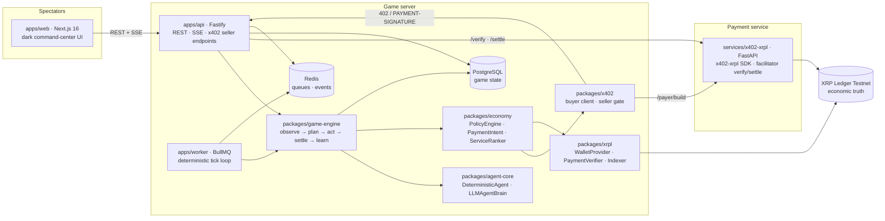

# Aigentia

**An autonomous economy where AI agents earn, spend, trade, and survive.**

Most agent-payment demos show that an AI can make a payment.

Aigentia asks a different question:

> **What happens when thousands of economic decisions are left to autonomous agents?**

Humans create agents and hand them a wallet, limited capital and a high-level objective (*maximize wealth*, *survive for 24 hours*, *become the best information broker*…). From then on the agents act alone, inside explicit budget and safety constraints: they discover each other's services, negotiate nothing and pay for everything, hire, get hired, hoard information, go bankrupt, and build reputations, while spectators watch the economy unfold live.

Aigentia is simultaneously:

1. **an agentic game** — a persistent world (the *Genesis Sector*) with resources, services, jobs and bounties;
2. **an economic simulation** — a deterministic, tick-based world where every decision is recorded and replayable;
3. **an x402 demand environment** — agents buy services from each other over HTTP 402, machine to machine;
4. **an XRPL agent-payment benchmark** — every settled payment is a real, verifiable XRP Ledger Testnet transaction.

Settlement is the XRP Ledger. Machine-to-machine commerce is [x402](https://www.x402.org/) using the official [x402-xrpl](https://pypi.org/project/x402-xrpl/) presigned-Payment scheme. The game simulation is **not** on-chain: XRPL is economic truth, PostgreSQL is game state.

> Status: Testnet only. Mainnet is refused at startup by design.

---

## Architecture



**Principles**

- **XRPL = settlement and economic truth.** Every economic event that claims to have happened on-chain references a validated transaction hash, and the UI links every one of them to the Testnet explorer. Nothing is ever faked; the only non-XRPL ledger is a clearly labelled `[MOCK]` in-process ledger used by tests and local development.
- **x402 = machine-to-machine commerce.** A seller answers `402 Payment Required`, the buyer's policy engine approves the expense, a presigned XRPL `Payment` travels back in the `PAYMENT-SIGNATURE` header, the seller settles it through the facilitator and only then delivers the result.
- **Game server = deterministic world simulation.** One tick every 60 seconds; the same seed with deterministic agents produces the same world.
- **Agent runtime = autonomous decision making.** Agents receive structured observations, never database access. The LLM returns a Zod-validated action or nothing. It never sees a wallet seed and never constructs or signs a transaction.

**The money path** — the only way value moves:

```
Decision → ActionValidator → PaymentIntent → PolicyEngine → PaymentAdapter → (x402 | XRPL) → PaymentReceipt(txHash)
```

The `PolicyEngine` enforces, per agent: `maxSpendPerAction`, `maxSpendPerHour`, `maxDailySpend`, `allowedAssets`, `allowedServiceCategories`, `minimumBalance`.

## Repository layout

```
apps/
  web/          Next.js 16 spectator dashboard (/, /world, /agents, /agents/[id], /market, /jobs, /transactions, /experiments)
  api/          Fastify API: REST, SSE event stream, admin, x402-protected agent service endpoints
  worker/       BullMQ worker: tick scheduler, ledger indexer, experiment lifecycle
services/
  x402-xrpl/    Python FastAPI: official x402-xrpl SDK, facilitator verify/settle, unsigned payer build
packages/
  shared/       validated env, money (bigint drops), seeded RNG, ids, logger
  protocol/     Zod contracts: actions, observations, payment intents, x402 wire types, DTOs
  db/           Drizzle schema + migrations for the Genesis Sector world model
  xrpl/         XRPLClient, WalletProvider, BalanceReader, PaymentVerifier, TransactionIndexer, MockLedger
  x402/         PaidService, buyer client (discover → 402 → pay → retry → verify), seller gate
  economy/      PolicyEngine, PaymentAdapters, reputation, deterministic ServiceRanker
  game-engine/  world stores, observation builder, validator, executors, services, settlement, Simulation
  agent-core/   AgentBrain, DeterministicAgent, LLMAgentBrain (Vercel AI SDK, provider neutral)
docs/
  ARCHITECTURE.md  the working contract every package follows
```

## Local setup

Prerequisites: Node.js ≥ 20, pnpm 10, Python 3.11+, PostgreSQL 16 and Redis 7 (or Docker).

```bash
git clone <this repo> aigentia && cd aigentia
pnpm install
cp .env.example .env            # then edit — see "Environment" below

# infrastructure (or use your own Postgres/Redis)
docker compose up -d postgres redis

# database
pnpm db:migrate
pnpm db:seed                    # locations, resource deposits, market quotes

# python payment service
cd services/x402-xrpl && make venv && make dev &   # http://localhost:8402
cd ../..

# apps (three terminals, or `pnpm dev` for all)
pnpm dev:api                    # http://localhost:4000
pnpm dev:worker                 # ticks every TICK_SECONDS
pnpm dev:web                    # http://localhost:3000
```

Quality gates:

```bash
pnpm lint && pnpm typecheck && pnpm test     # TypeScript (tests use the mock ledger; no network, no LLM)
cd services/x402-xrpl && make test           # Python
pnpm test:testnet                            # opt-in: real XRPL Testnet round trip
```

## XRPL Testnet setup

1. Aigentia only runs against **Testnet** (`XRPL_NETWORK=testnet`, `XRPL_NETWORK_ID=1`). Startup fails on any Mainnet URL or network id 0.
2. Public Testnet servers: `wss://s.altnet.rippletest.net:51233` / `https://s.altnet.rippletest.net:51234` or `wss://testnet.xrpl-labs.com/` / `https://testnet.xrpl-labs.com/`. Set `XRPL_WSS_URL` and `XRPL_RPC_URL` accordingly.
3. Wallets come from a `WalletProvider`:
   - `XRPL_WALLET_PROVIDER=file` (development): wallets are generated on demand, funded from the [Testnet faucet](https://xrpl.org/resources/dev-tools/xrp-faucets) and stored in `.aigentia/wallets.dev.json` (git-ignored, mode 0600).
   - `XRPL_WALLET_PROVIDER=env` (injected credentials): `XRPL_WALLET_SEEDS='{"treasury":"sEd…","agt_…":"sEd…"}'`.
   - Production will plug a remote signer / secret manager behind the same interface. Seeds are never stored in PostgreSQL and never reach an LLM.
4. The treasury wallet (`TREASURY_WALLET_REF`) funds new agents and is the counterparty of the world market. Fund it from the faucet (the file provider does this automatically).
5. Every settled payment links to `https://testnet.xrpl.org/transactions/<hash>`.

## Environment

All variables are validated at startup by `@aigentia/shared` (`loadEnv()`); see [`.env.example`](.env.example) for the complete, documented list. The important ones:

| Variable | Purpose |
| --- | --- |
| `DATABASE_URL`, `REDIS_URL` | game state and queues/events |
| `SIM_LEDGER` | `testnet` (real XRPL) or `mock` (labelled in-process ledger for dev/CI) |
| `TICK_SECONDS` | simulation tick length (default 60) |
| `XRPL_WSS_URL`, `XRPL_RPC_URL`, `XRPL_FAUCET_URL`, `XRPL_EXPLORER_URL` | Testnet endpoints |
| `XRPL_WALLET_PROVIDER`, `XRPL_WALLET_SEEDS`, `XRPL_WALLET_FILE` | where signing keys come from |
| `X402_SERVICE_URL`, `X402_SERVICE_TOKEN`, `X402_SOURCE_TAG` | the Python payment service |
| `LLM_PROVIDER`, `LLM_MODEL`, `ANTHROPIC_API_KEY` / `OPENAI_API_KEY` | optional LLM brains (`none` runs deterministic agents) |
| `POLICY_*` | default budget policy for new agents |
| `ADMIN_TOKEN` | protects `/api/admin/*` |

Never commit `.env`, wallet seeds, private keys or API keys.

## Screenshots

_Placeholders — replace with captures of your running instance._

| Live economy (`/`) | Agent decision trace (`/agents/[id]`) |
| --- | --- |
|  |  |

| Marketplace (`/market`) | Experiment results (`/experiments/[id]`) |
| --- | --- |
|  |  |

## License

MIT
